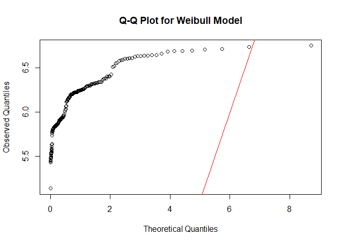
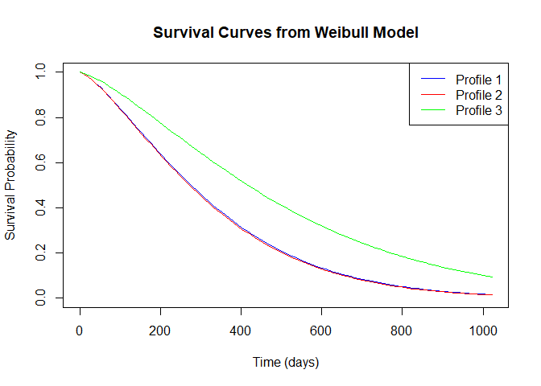
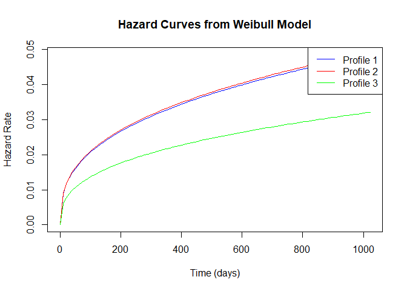

Survival (Kaplain Meier, Cox Proportional, and Weibull) modelling
================
Joshua Edefo
2024-08-17

Libraries

``` r
library(survival)
```

    ## Warning: package 'survival' was built under R version 4.3.3

``` r
library(survminer)  # For enhanced survival plots
```

    ## Warning: package 'survminer' was built under R version 4.3.3

    ## Warning: package 'ggplot2' was built under R version 4.3.2

    ## Warning: package 'ggpubr' was built under R version 4.3.3

``` r
library(usethis)
```

    ## Warning: package 'usethis' was built under R version 4.3.2

Load the lung dataset

``` r
lung
```

    ##     inst time status age sex ph.ecog ph.karno pat.karno meal.cal wt.loss
    ## 1      3  306      2  74   1       1       90       100     1175      NA
    ## 2      3  455      2  68   1       0       90        90     1225      15
    ## 3      3 1010      1  56   1       0       90        90       NA      15
    ## 4      5  210      2  57   1       1       90        60     1150      11
    ## 5      1  883      2  60   1       0      100        90       NA       0
    ## 6     12 1022      1  74   1       1       50        80      513       0
    ## 7      7  310      2  68   2       2       70        60      384      10
    ## 8     11  361      2  71   2       2       60        80      538       1
    ## 9      1  218      2  53   1       1       70        80      825      16
    ## 10     7  166      2  61   1       2       70        70      271      34
    ## 11     6  170      2  57   1       1       80        80     1025      27
    ## 12    16  654      2  68   2       2       70        70       NA      23
    ## 13    11  728      2  68   2       1       90        90       NA       5
    ## 14    21   71      2  60   1      NA       60        70     1225      32
    ## 15    12  567      2  57   1       1       80        70     2600      60
    ## 16     1  144      2  67   1       1       80        90       NA      15
    ## 17    22  613      2  70   1       1       90       100     1150      -5
    ## 18    16  707      2  63   1       2       50        70     1025      22
    ## 19     1   61      2  56   2       2       60        60      238      10
    ## 20    21   88      2  57   1       1       90        80     1175      NA
    ## 21    11  301      2  67   1       1       80        80     1025      17
    ## 22     6   81      2  49   2       0      100        70     1175      -8
    ## 23    11  624      2  50   1       1       70        80       NA      16
    ## 24    15  371      2  58   1       0       90       100      975      13
    ## 25    12  394      2  72   1       0       90        80       NA       0
    ## 26    12  520      2  70   2       1       90        80      825       6
    ## 27     4  574      2  60   1       0      100       100     1025     -13
    ## 28    13  118      2  70   1       3       60        70     1075      20
    ## 29    13  390      2  53   1       1       80        70      875      -7
    ## 30     1   12      2  74   1       2       70        50      305      20
    ## 31    12  473      2  69   2       1       90        90     1025      -1
    ## 32     1   26      2  73   1       2       60        70      388      20
    ## 33     7  533      2  48   1       2       60        80       NA     -11
    ## 34    16  107      2  60   2       2       50        60      925     -15
    ## 35    12   53      2  61   1       2       70       100     1075      10
    ## 36     1  122      2  62   2       2       50        50     1025      NA
    ## 37    22  814      2  65   1       2       70        60      513      28
    ## 38    15  965      1  66   2       1       70        90      875       4
    ## 39     1   93      2  74   1       2       50        40     1225      24
    ## 40     1  731      2  64   2       1       80       100     1175      15
    ## 41     5  460      2  70   1       1       80        60      975      10
    ## 42    11  153      2  73   2       2       60        70     1075      11
    ## 43    10  433      2  59   2       0       90        90      363      27
    ## 44    12  145      2  60   2       2       70        60       NA      NA
    ## 45     7  583      2  68   1       1       60        70     1025       7
    ## 46     7   95      2  76   2       2       60        60      625     -24
    ## 47     1  303      2  74   1       0       90        70      463      30
    ## 48     3  519      2  63   1       1       80        70     1025      10
    ## 49    13  643      2  74   1       0       90        90     1425       2
    ## 50    22  765      2  50   2       1       90       100     1175       4
    ## 51     3  735      2  72   2       1       90        90       NA       9
    ## 52    12  189      2  63   1       0       80        70       NA       0
    ## 53    21   53      2  68   1       0       90       100     1025       0
    ## 54     1  246      2  58   1       0      100        90     1175       7
    ## 55     6  689      2  59   1       1       90        80     1300      15
    ## 56     1   65      2  62   1       0       90        80      725      NA
    ## 57     5    5      2  65   2       0      100        80      338       5
    ## 58    22  132      2  57   1       2       70        60       NA      18
    ## 59     3  687      2  58   2       1       80        80     1225      10
    ## 60     1  345      2  64   2       1       90        80     1075      -3
    ## 61    22  444      2  75   2       2       70        70      438       8
    ## 62    12  223      2  48   1       1       90        80     1300      68
    ## 63    21  175      2  73   1       1       80       100     1025      NA
    ## 64    11   60      2  65   2       1       90        80     1025       0
    ## 65     3  163      2  69   1       1       80        60     1125       0
    ## 66     3   65      2  68   1       2       70        50      825       8
    ## 67    16  208      2  67   2       2       70        NA      538       2
    ## 68     5  821      1  64   2       0       90        70     1025       3
    ## 69    22  428      2  68   1       0      100        80     1039       0
    ## 70     6  230      2  67   1       1       80       100      488      23
    ## 71    13  840      1  63   1       0       90        90     1175      -1
    ## 72     3  305      2  48   2       1       80        90      538      29
    ## 73     5   11      2  74   1       2       70       100     1175       0
    ## 74     2  132      2  40   1       1       80        80       NA       3
    ## 75    21  226      2  53   2       1       90        80      825       3
    ## 76    12  426      2  71   2       1       90        90     1075      19
    ## 77     1  705      2  51   2       0      100        80     1300       0
    ## 78     6  363      2  56   2       1       80        70     1225      -2
    ## 79     3   11      2  81   1       0       90        NA      731      15
    ## 80     1  176      2  73   1       0       90        70      169      30
    ## 81     4  791      2  59   1       0      100        80      768       5
    ## 82    13   95      2  55   1       1       70        90     1500      15
    ## 83    11  196      1  42   1       1       80        80     1425       8
    ## 84    21  167      2  44   2       1       80        90      588      -1
    ## 85    16  806      1  44   1       1       80        80     1025       1
    ## 86     6  284      2  71   1       1       80        90     1100      14
    ## 87    22  641      2  62   2       1       80        80     1150       1
    ## 88    21  147      2  61   1       0      100        90     1175       4
    ## 89    13  740      1  44   2       1       90        80      588      39
    ## 90     1  163      2  72   1       2       70        70      910       2
    ## 91    11  655      2  63   1       0      100        90      975      -1
    ## 92    22  239      2  70   1       1       80       100       NA      23
    ## 93     5   88      2  66   1       1       90        80      875       8
    ## 94    10  245      2  57   2       1       80        60      280      14
    ## 95     1  588      1  69   2       0      100        90       NA      13
    ## 96    12   30      2  72   1       2       80        60      288       7
    ## 97     3  179      2  69   1       1       80        80       NA      25
    ## 98    12  310      2  71   1       1       90       100       NA       0
    ## 99    11  477      2  64   1       1       90       100      910       0
    ## 100    3  166      2  70   2       0       90        70       NA      10
    ## 101    1  559      1  58   2       0      100       100      710      15
    ## 102    6  450      2  69   2       1       80        90     1175       3
    ## 103   13  364      2  56   1       1       70        80       NA       4
    ## 104    6  107      2  63   1       1       90        70       NA       0
    ## 105   13  177      2  59   1       2       50        NA       NA      32
    ## 106   12  156      2  66   1       1       80        90      875      14
    ## 107   26  529      1  54   2       1       80       100      975      -3
    ## 108    1   11      2  67   1       1       90        90      925      NA
    ## 109   21  429      2  55   1       1      100        80      975       5
    ## 110    3  351      2  75   2       2       60        50      925      11
    ## 111   13   15      2  69   1       0       90        70      575      10
    ## 112    1  181      2  44   1       1       80        90     1175       5
    ## 113   10  283      2  80   1       1       80       100     1030       6
    ## 114    3  201      2  75   2       0       90       100       NA       1
    ## 115    6  524      2  54   2       1       80       100       NA      15
    ## 116    1   13      2  76   1       2       70        70      413      20
    ## 117    3  212      2  49   1       2       70        60      675      20
    ## 118    1  524      2  68   1       2       60        70     1300      30
    ## 119   16  288      2  66   1       2       70        60      613      24
    ## 120   15  363      2  80   1       1       80        90      346      11
    ## 121   22  442      2  75   1       0       90        90       NA       0
    ## 122   26  199      2  60   2       2       70        80      675      10
    ## 123    3  550      2  69   2       1       70        80      910       0
    ## 124   11   54      2  72   1       2       60        60      768      -3
    ## 125    1  558      2  70   1       0       90        90     1025      17
    ## 126   22  207      2  66   1       1       80        80      925      20
    ## 127    7   92      2  50   1       1       80        60     1075      13
    ## 128   12   60      2  64   1       1       80        90      993       0
    ## 129   16  551      1  77   2       2       80        60      750      28
    ## 130   12  543      1  48   2       0       90        60       NA       4
    ## 131    4  293      2  59   2       1       80        80      925      52
    ## 132   16  202      2  53   1       1       80        80       NA      20
    ## 133    6  353      2  47   1       0      100        90     1225       5
    ## 134   13  511      1  55   2       1       80        70       NA      49
    ## 135    1  267      2  67   1       0       90        70      313       6
    ## 136   22  511      1  74   2       2       60        40       96      37
    ## 137   12  371      2  58   2       1       80        70       NA       0
    ## 138   13  387      2  56   1       2       80        60     1075      NA
    ## 139    1  457      2  54   1       1       90        90      975      -5
    ## 140    5  337      2  56   1       0      100       100     1500      15
    ## 141   21  201      2  73   2       2       70        60     1225     -16
    ## 142    3  404      1  74   1       1       80        70      413      38
    ## 143   26  222      2  76   1       2       70        70     1500       8
    ## 144    1   62      2  65   2       1       80        90     1075       0
    ## 145   11  458      1  57   1       1       80       100      513      30
    ## 146   26  356      1  53   2       1       90        90       NA       2
    ## 147   16  353      2  71   1       0      100        80      775       2
    ## 148   16  163      2  54   1       1       90        80     1225      13
    ## 149   12   31      2  82   1       0      100        90      413      27
    ## 150   13  340      2  59   2       0      100        90       NA       0
    ## 151   13  229      2  70   1       1       70        60     1175      -2
    ## 152   22  444      1  60   1       0       90       100       NA       7
    ## 153    5  315      1  62   2       0       90        90       NA       0
    ## 154   16  182      2  53   2       1       80        60       NA       4
    ## 155   32  156      2  55   1       2       70        30     1025      10
    ## 156   NA  329      2  69   1       2       70        80      713      20
    ## 157   26  364      1  68   2       1       90        90       NA       7
    ## 158    4  291      2  62   1       2       70        60      475      27
    ## 159   12  179      2  63   1       1       80        70      538      -2
    ## 160    1  376      1  56   2       1       80        90      825      17
    ## 161   32  384      1  62   2       0       90        90      588       8
    ## 162   10  268      2  44   2       1       90       100     2450       2
    ## 163   11  292      1  69   1       2       60        70     2450      36
    ## 164    6  142      2  63   1       1       90        80      875       2
    ## 165    7  413      1  64   1       1       80        70      413      16
    ## 166   16  266      1  57   2       0       90        90     1075       3
    ## 167   11  194      2  60   2       1       80        60       NA      33
    ## 168   21  320      2  46   1       0      100       100      860       4
    ## 169    6  181      2  61   1       1       90        90      730       0
    ## 170   12  285      2  65   1       0      100        90     1025       0
    ## 171   13  301      1  61   1       1       90       100      825       2
    ## 172    2  348      2  58   2       0       90        80     1225      10
    ## 173    2  197      2  56   1       1       90        60      768      37
    ## 174   16  382      1  43   2       0      100        90      338       6
    ## 175    1  303      1  53   1       1       90        80     1225      12
    ## 176   13  296      1  59   2       1       80       100     1025       0
    ## 177    1  180      2  56   1       2       60        80     1225      -2
    ## 178   13  186      2  55   2       1       80        70       NA      NA
    ## 179    1  145      2  53   2       1       80        90      588      13
    ## 180    7  269      1  74   2       0      100       100      588       0
    ## 181   13  300      1  60   1       0      100       100      975       5
    ## 182    1  284      1  39   1       0      100        90     1225      -5
    ## 183   16  350      2  66   2       0       90       100     1025      NA
    ## 184   32  272      1  65   2       1       80        90       NA      -1
    ## 185   12  292      1  51   2       0       90        80     1225       0
    ## 186   12  332      1  45   2       0       90       100      975       5
    ## 187    2  285      2  72   2       2       70        90      463      20
    ## 188    3  259      1  58   1       0       90        80     1300       8
    ## 189   15  110      2  64   1       1       80        60     1025      12
    ## 190   22  286      2  53   1       0       90        90     1225       8
    ## 191   16  270      2  72   1       1       80        90      488      14
    ## 192   16   81      2  52   1       2       60        70     1075      NA
    ## 193   12  131      2  50   1       1       90        80      513      NA
    ## 194    1  225      1  64   1       1       90        80      825      33
    ## 195   22  269      2  71   1       1       90        90     1300      -2
    ## 196   12  225      1  70   1       0      100       100     1175       6
    ## 197   32  243      1  63   2       1       80        90      825       0
    ## 198   21  279      1  64   1       1       90        90       NA       4
    ## 199    1  276      1  52   2       0      100        80      975       0
    ## 200   32  135      2  60   1       1       90        70     1275       0
    ## 201   15   79      2  64   2       1       90        90      488      37
    ## 202   22   59      2  73   1       1       60        60     2200       5
    ## 203   32  240      1  63   2       0       90       100     1025       0
    ## 204    3  202      1  50   2       0      100       100      635       1
    ## 205   26  235      1  63   2       0      100        90      413       0
    ## 206   33  105      2  62   1       2       NA        70       NA      NA
    ## 207    5  224      1  55   2       0       80        90       NA      23
    ## 208   13  239      2  50   2       2       60        60     1025      -3
    ## 209   21  237      1  69   1       1       80        70       NA      NA
    ## 210   33  173      1  59   2       1       90        80       NA      10
    ## 211    1  252      1  60   2       0      100        90      488      -2
    ## 212    6  221      1  67   1       1       80        70      413      23
    ## 213   15  185      1  69   1       1       90        70     1075       0
    ## 214   11   92      1  64   2       2       70       100       NA      31
    ## 215   11   13      2  65   1       1       80        90       NA      10
    ## 216   11  222      1  65   1       1       90        70     1025      18
    ## 217   13  192      1  41   2       1       90        80       NA     -10
    ## 218   21  183      2  76   1       2       80        60      825       7
    ## 219   11  211      1  70   2       2       70        30      131       3
    ## 220    2  175      1  57   2       0       80        80      725      11
    ## 221   22  197      1  67   1       1       80        90     1500       2
    ## 222   11  203      1  71   2       1       80        90     1025       0
    ## 223    1  116      2  76   1       1       80        80       NA       0
    ## 224    1  188      1  77   1       1       80        60       NA       3
    ## 225   13  191      1  39   1       0       90        90     2350      -5
    ## 226   32  105      1  75   2       2       60        70     1025       5
    ## 227    6  174      1  66   1       1       90       100     1075       1
    ## 228   22  177      1  58   2       1       80        90     1060       0

``` r
data <- lung
data
```

    ##     inst time status age sex ph.ecog ph.karno pat.karno meal.cal wt.loss
    ## 1      3  306      2  74   1       1       90       100     1175      NA
    ## 2      3  455      2  68   1       0       90        90     1225      15
    ## 3      3 1010      1  56   1       0       90        90       NA      15
    ## 4      5  210      2  57   1       1       90        60     1150      11
    ## 5      1  883      2  60   1       0      100        90       NA       0
    ## 6     12 1022      1  74   1       1       50        80      513       0
    ## 7      7  310      2  68   2       2       70        60      384      10
    ## 8     11  361      2  71   2       2       60        80      538       1
    ## 9      1  218      2  53   1       1       70        80      825      16
    ## 10     7  166      2  61   1       2       70        70      271      34
    ## 11     6  170      2  57   1       1       80        80     1025      27
    ## 12    16  654      2  68   2       2       70        70       NA      23
    ## 13    11  728      2  68   2       1       90        90       NA       5
    ## 14    21   71      2  60   1      NA       60        70     1225      32
    ## 15    12  567      2  57   1       1       80        70     2600      60
    ## 16     1  144      2  67   1       1       80        90       NA      15
    ## 17    22  613      2  70   1       1       90       100     1150      -5
    ## 18    16  707      2  63   1       2       50        70     1025      22
    ## 19     1   61      2  56   2       2       60        60      238      10
    ## 20    21   88      2  57   1       1       90        80     1175      NA
    ## 21    11  301      2  67   1       1       80        80     1025      17
    ## 22     6   81      2  49   2       0      100        70     1175      -8
    ## 23    11  624      2  50   1       1       70        80       NA      16
    ## 24    15  371      2  58   1       0       90       100      975      13
    ## 25    12  394      2  72   1       0       90        80       NA       0
    ## 26    12  520      2  70   2       1       90        80      825       6
    ## 27     4  574      2  60   1       0      100       100     1025     -13
    ## 28    13  118      2  70   1       3       60        70     1075      20
    ## 29    13  390      2  53   1       1       80        70      875      -7
    ## 30     1   12      2  74   1       2       70        50      305      20
    ## 31    12  473      2  69   2       1       90        90     1025      -1
    ## 32     1   26      2  73   1       2       60        70      388      20
    ## 33     7  533      2  48   1       2       60        80       NA     -11
    ## 34    16  107      2  60   2       2       50        60      925     -15
    ## 35    12   53      2  61   1       2       70       100     1075      10
    ## 36     1  122      2  62   2       2       50        50     1025      NA
    ## 37    22  814      2  65   1       2       70        60      513      28
    ## 38    15  965      1  66   2       1       70        90      875       4
    ## 39     1   93      2  74   1       2       50        40     1225      24
    ## 40     1  731      2  64   2       1       80       100     1175      15
    ## 41     5  460      2  70   1       1       80        60      975      10
    ## 42    11  153      2  73   2       2       60        70     1075      11
    ## 43    10  433      2  59   2       0       90        90      363      27
    ## 44    12  145      2  60   2       2       70        60       NA      NA
    ## 45     7  583      2  68   1       1       60        70     1025       7
    ## 46     7   95      2  76   2       2       60        60      625     -24
    ## 47     1  303      2  74   1       0       90        70      463      30
    ## 48     3  519      2  63   1       1       80        70     1025      10
    ## 49    13  643      2  74   1       0       90        90     1425       2
    ## 50    22  765      2  50   2       1       90       100     1175       4
    ## 51     3  735      2  72   2       1       90        90       NA       9
    ## 52    12  189      2  63   1       0       80        70       NA       0
    ## 53    21   53      2  68   1       0       90       100     1025       0
    ## 54     1  246      2  58   1       0      100        90     1175       7
    ## 55     6  689      2  59   1       1       90        80     1300      15
    ## 56     1   65      2  62   1       0       90        80      725      NA
    ## 57     5    5      2  65   2       0      100        80      338       5
    ## 58    22  132      2  57   1       2       70        60       NA      18
    ## 59     3  687      2  58   2       1       80        80     1225      10
    ## 60     1  345      2  64   2       1       90        80     1075      -3
    ## 61    22  444      2  75   2       2       70        70      438       8
    ## 62    12  223      2  48   1       1       90        80     1300      68
    ## 63    21  175      2  73   1       1       80       100     1025      NA
    ## 64    11   60      2  65   2       1       90        80     1025       0
    ## 65     3  163      2  69   1       1       80        60     1125       0
    ## 66     3   65      2  68   1       2       70        50      825       8
    ## 67    16  208      2  67   2       2       70        NA      538       2
    ## 68     5  821      1  64   2       0       90        70     1025       3
    ## 69    22  428      2  68   1       0      100        80     1039       0
    ## 70     6  230      2  67   1       1       80       100      488      23
    ## 71    13  840      1  63   1       0       90        90     1175      -1
    ## 72     3  305      2  48   2       1       80        90      538      29
    ## 73     5   11      2  74   1       2       70       100     1175       0
    ## 74     2  132      2  40   1       1       80        80       NA       3
    ## 75    21  226      2  53   2       1       90        80      825       3
    ## 76    12  426      2  71   2       1       90        90     1075      19
    ## 77     1  705      2  51   2       0      100        80     1300       0
    ## 78     6  363      2  56   2       1       80        70     1225      -2
    ## 79     3   11      2  81   1       0       90        NA      731      15
    ## 80     1  176      2  73   1       0       90        70      169      30
    ## 81     4  791      2  59   1       0      100        80      768       5
    ## 82    13   95      2  55   1       1       70        90     1500      15
    ## 83    11  196      1  42   1       1       80        80     1425       8
    ## 84    21  167      2  44   2       1       80        90      588      -1
    ## 85    16  806      1  44   1       1       80        80     1025       1
    ## 86     6  284      2  71   1       1       80        90     1100      14
    ## 87    22  641      2  62   2       1       80        80     1150       1
    ## 88    21  147      2  61   1       0      100        90     1175       4
    ## 89    13  740      1  44   2       1       90        80      588      39
    ## 90     1  163      2  72   1       2       70        70      910       2
    ## 91    11  655      2  63   1       0      100        90      975      -1
    ## 92    22  239      2  70   1       1       80       100       NA      23
    ## 93     5   88      2  66   1       1       90        80      875       8
    ## 94    10  245      2  57   2       1       80        60      280      14
    ## 95     1  588      1  69   2       0      100        90       NA      13
    ## 96    12   30      2  72   1       2       80        60      288       7
    ## 97     3  179      2  69   1       1       80        80       NA      25
    ## 98    12  310      2  71   1       1       90       100       NA       0
    ## 99    11  477      2  64   1       1       90       100      910       0
    ## 100    3  166      2  70   2       0       90        70       NA      10
    ## 101    1  559      1  58   2       0      100       100      710      15
    ## 102    6  450      2  69   2       1       80        90     1175       3
    ## 103   13  364      2  56   1       1       70        80       NA       4
    ## 104    6  107      2  63   1       1       90        70       NA       0
    ## 105   13  177      2  59   1       2       50        NA       NA      32
    ## 106   12  156      2  66   1       1       80        90      875      14
    ## 107   26  529      1  54   2       1       80       100      975      -3
    ## 108    1   11      2  67   1       1       90        90      925      NA
    ## 109   21  429      2  55   1       1      100        80      975       5
    ## 110    3  351      2  75   2       2       60        50      925      11
    ## 111   13   15      2  69   1       0       90        70      575      10
    ## 112    1  181      2  44   1       1       80        90     1175       5
    ## 113   10  283      2  80   1       1       80       100     1030       6
    ## 114    3  201      2  75   2       0       90       100       NA       1
    ## 115    6  524      2  54   2       1       80       100       NA      15
    ## 116    1   13      2  76   1       2       70        70      413      20
    ## 117    3  212      2  49   1       2       70        60      675      20
    ## 118    1  524      2  68   1       2       60        70     1300      30
    ## 119   16  288      2  66   1       2       70        60      613      24
    ## 120   15  363      2  80   1       1       80        90      346      11
    ## 121   22  442      2  75   1       0       90        90       NA       0
    ## 122   26  199      2  60   2       2       70        80      675      10
    ## 123    3  550      2  69   2       1       70        80      910       0
    ## 124   11   54      2  72   1       2       60        60      768      -3
    ## 125    1  558      2  70   1       0       90        90     1025      17
    ## 126   22  207      2  66   1       1       80        80      925      20
    ## 127    7   92      2  50   1       1       80        60     1075      13
    ## 128   12   60      2  64   1       1       80        90      993       0
    ## 129   16  551      1  77   2       2       80        60      750      28
    ## 130   12  543      1  48   2       0       90        60       NA       4
    ## 131    4  293      2  59   2       1       80        80      925      52
    ## 132   16  202      2  53   1       1       80        80       NA      20
    ## 133    6  353      2  47   1       0      100        90     1225       5
    ## 134   13  511      1  55   2       1       80        70       NA      49
    ## 135    1  267      2  67   1       0       90        70      313       6
    ## 136   22  511      1  74   2       2       60        40       96      37
    ## 137   12  371      2  58   2       1       80        70       NA       0
    ## 138   13  387      2  56   1       2       80        60     1075      NA
    ## 139    1  457      2  54   1       1       90        90      975      -5
    ## 140    5  337      2  56   1       0      100       100     1500      15
    ## 141   21  201      2  73   2       2       70        60     1225     -16
    ## 142    3  404      1  74   1       1       80        70      413      38
    ## 143   26  222      2  76   1       2       70        70     1500       8
    ## 144    1   62      2  65   2       1       80        90     1075       0
    ## 145   11  458      1  57   1       1       80       100      513      30
    ## 146   26  356      1  53   2       1       90        90       NA       2
    ## 147   16  353      2  71   1       0      100        80      775       2
    ## 148   16  163      2  54   1       1       90        80     1225      13
    ## 149   12   31      2  82   1       0      100        90      413      27
    ## 150   13  340      2  59   2       0      100        90       NA       0
    ## 151   13  229      2  70   1       1       70        60     1175      -2
    ## 152   22  444      1  60   1       0       90       100       NA       7
    ## 153    5  315      1  62   2       0       90        90       NA       0
    ## 154   16  182      2  53   2       1       80        60       NA       4
    ## 155   32  156      2  55   1       2       70        30     1025      10
    ## 156   NA  329      2  69   1       2       70        80      713      20
    ## 157   26  364      1  68   2       1       90        90       NA       7
    ## 158    4  291      2  62   1       2       70        60      475      27
    ## 159   12  179      2  63   1       1       80        70      538      -2
    ## 160    1  376      1  56   2       1       80        90      825      17
    ## 161   32  384      1  62   2       0       90        90      588       8
    ## 162   10  268      2  44   2       1       90       100     2450       2
    ## 163   11  292      1  69   1       2       60        70     2450      36
    ## 164    6  142      2  63   1       1       90        80      875       2
    ## 165    7  413      1  64   1       1       80        70      413      16
    ## 166   16  266      1  57   2       0       90        90     1075       3
    ## 167   11  194      2  60   2       1       80        60       NA      33
    ## 168   21  320      2  46   1       0      100       100      860       4
    ## 169    6  181      2  61   1       1       90        90      730       0
    ## 170   12  285      2  65   1       0      100        90     1025       0
    ## 171   13  301      1  61   1       1       90       100      825       2
    ## 172    2  348      2  58   2       0       90        80     1225      10
    ## 173    2  197      2  56   1       1       90        60      768      37
    ## 174   16  382      1  43   2       0      100        90      338       6
    ## 175    1  303      1  53   1       1       90        80     1225      12
    ## 176   13  296      1  59   2       1       80       100     1025       0
    ## 177    1  180      2  56   1       2       60        80     1225      -2
    ## 178   13  186      2  55   2       1       80        70       NA      NA
    ## 179    1  145      2  53   2       1       80        90      588      13
    ## 180    7  269      1  74   2       0      100       100      588       0
    ## 181   13  300      1  60   1       0      100       100      975       5
    ## 182    1  284      1  39   1       0      100        90     1225      -5
    ## 183   16  350      2  66   2       0       90       100     1025      NA
    ## 184   32  272      1  65   2       1       80        90       NA      -1
    ## 185   12  292      1  51   2       0       90        80     1225       0
    ## 186   12  332      1  45   2       0       90       100      975       5
    ## 187    2  285      2  72   2       2       70        90      463      20
    ## 188    3  259      1  58   1       0       90        80     1300       8
    ## 189   15  110      2  64   1       1       80        60     1025      12
    ## 190   22  286      2  53   1       0       90        90     1225       8
    ## 191   16  270      2  72   1       1       80        90      488      14
    ## 192   16   81      2  52   1       2       60        70     1075      NA
    ## 193   12  131      2  50   1       1       90        80      513      NA
    ## 194    1  225      1  64   1       1       90        80      825      33
    ## 195   22  269      2  71   1       1       90        90     1300      -2
    ## 196   12  225      1  70   1       0      100       100     1175       6
    ## 197   32  243      1  63   2       1       80        90      825       0
    ## 198   21  279      1  64   1       1       90        90       NA       4
    ## 199    1  276      1  52   2       0      100        80      975       0
    ## 200   32  135      2  60   1       1       90        70     1275       0
    ## 201   15   79      2  64   2       1       90        90      488      37
    ## 202   22   59      2  73   1       1       60        60     2200       5
    ## 203   32  240      1  63   2       0       90       100     1025       0
    ## 204    3  202      1  50   2       0      100       100      635       1
    ## 205   26  235      1  63   2       0      100        90      413       0
    ## 206   33  105      2  62   1       2       NA        70       NA      NA
    ## 207    5  224      1  55   2       0       80        90       NA      23
    ## 208   13  239      2  50   2       2       60        60     1025      -3
    ## 209   21  237      1  69   1       1       80        70       NA      NA
    ## 210   33  173      1  59   2       1       90        80       NA      10
    ## 211    1  252      1  60   2       0      100        90      488      -2
    ## 212    6  221      1  67   1       1       80        70      413      23
    ## 213   15  185      1  69   1       1       90        70     1075       0
    ## 214   11   92      1  64   2       2       70       100       NA      31
    ## 215   11   13      2  65   1       1       80        90       NA      10
    ## 216   11  222      1  65   1       1       90        70     1025      18
    ## 217   13  192      1  41   2       1       90        80       NA     -10
    ## 218   21  183      2  76   1       2       80        60      825       7
    ## 219   11  211      1  70   2       2       70        30      131       3
    ## 220    2  175      1  57   2       0       80        80      725      11
    ## 221   22  197      1  67   1       1       80        90     1500       2
    ## 222   11  203      1  71   2       1       80        90     1025       0
    ## 223    1  116      2  76   1       1       80        80       NA       0
    ## 224    1  188      1  77   1       1       80        60       NA       3
    ## 225   13  191      1  39   1       0       90        90     2350      -5
    ## 226   32  105      1  75   2       2       60        70     1025       5
    ## 227    6  174      1  66   1       1       90       100     1075       1
    ## 228   22  177      1  58   2       1       80        90     1060       0

``` r
head(data)
```

    ##   inst time status age sex ph.ecog ph.karno pat.karno meal.cal wt.loss
    ## 1    3  306      2  74   1       1       90       100     1175      NA
    ## 2    3  455      2  68   1       0       90        90     1225      15
    ## 3    3 1010      1  56   1       0       90        90       NA      15
    ## 4    5  210      2  57   1       1       90        60     1150      11
    ## 5    1  883      2  60   1       0      100        90       NA       0
    ## 6   12 1022      1  74   1       1       50        80      513       0

``` r
str(data)
```

    ## 'data.frame':    228 obs. of  10 variables:
    ##  $ inst     : num  3 3 3 5 1 12 7 11 1 7 ...
    ##  $ time     : num  306 455 1010 210 883 ...
    ##  $ status   : num  2 2 1 2 2 1 2 2 2 2 ...
    ##  $ age      : num  74 68 56 57 60 74 68 71 53 61 ...
    ##  $ sex      : num  1 1 1 1 1 1 2 2 1 1 ...
    ##  $ ph.ecog  : num  1 0 0 1 0 1 2 2 1 2 ...
    ##  $ ph.karno : num  90 90 90 90 100 50 70 60 70 70 ...
    ##  $ pat.karno: num  100 90 90 60 90 80 60 80 80 70 ...
    ##  $ meal.cal : num  1175 1225 NA 1150 NA ...
    ##  $ wt.loss  : num  NA 15 15 11 0 0 10 1 16 34 ...

Kaplan-Meier model estimator for overall survival

``` r
km_fit <- survfit(Surv(time, status) ~ 1, data = lung)
km_fit
```

    ## Call: survfit(formula = Surv(time, status) ~ 1, data = lung)
    ## 
    ##        n events median 0.95LCL 0.95UCL
    ## [1,] 228    165    310     285     363

``` r
# Summary of Kaplan-Meier fit
summary(km_fit)
```

    ## Call: survfit(formula = Surv(time, status) ~ 1, data = lung)
    ## 
    ##  time n.risk n.event survival std.err lower 95% CI upper 95% CI
    ##     5    228       1   0.9956 0.00438       0.9871        1.000
    ##    11    227       3   0.9825 0.00869       0.9656        1.000
    ##    12    224       1   0.9781 0.00970       0.9592        0.997
    ##    13    223       2   0.9693 0.01142       0.9472        0.992
    ##    15    221       1   0.9649 0.01219       0.9413        0.989
    ##    26    220       1   0.9605 0.01290       0.9356        0.986
    ##    30    219       1   0.9561 0.01356       0.9299        0.983
    ##    31    218       1   0.9518 0.01419       0.9243        0.980
    ##    53    217       2   0.9430 0.01536       0.9134        0.974
    ##    54    215       1   0.9386 0.01590       0.9079        0.970
    ##    59    214       1   0.9342 0.01642       0.9026        0.967
    ##    60    213       2   0.9254 0.01740       0.8920        0.960
    ##    61    211       1   0.9211 0.01786       0.8867        0.957
    ##    62    210       1   0.9167 0.01830       0.8815        0.953
    ##    65    209       2   0.9079 0.01915       0.8711        0.946
    ##    71    207       1   0.9035 0.01955       0.8660        0.943
    ##    79    206       1   0.8991 0.01995       0.8609        0.939
    ##    81    205       2   0.8904 0.02069       0.8507        0.932
    ##    88    203       2   0.8816 0.02140       0.8406        0.925
    ##    92    201       1   0.8772 0.02174       0.8356        0.921
    ##    93    199       1   0.8728 0.02207       0.8306        0.917
    ##    95    198       2   0.8640 0.02271       0.8206        0.910
    ##   105    196       1   0.8596 0.02302       0.8156        0.906
    ##   107    194       2   0.8507 0.02362       0.8056        0.898
    ##   110    192       1   0.8463 0.02391       0.8007        0.894
    ##   116    191       1   0.8418 0.02419       0.7957        0.891
    ##   118    190       1   0.8374 0.02446       0.7908        0.887
    ##   122    189       1   0.8330 0.02473       0.7859        0.883
    ##   131    188       1   0.8285 0.02500       0.7810        0.879
    ##   132    187       2   0.8197 0.02550       0.7712        0.871
    ##   135    185       1   0.8153 0.02575       0.7663        0.867
    ##   142    184       1   0.8108 0.02598       0.7615        0.863
    ##   144    183       1   0.8064 0.02622       0.7566        0.859
    ##   145    182       2   0.7975 0.02667       0.7469        0.852
    ##   147    180       1   0.7931 0.02688       0.7421        0.848
    ##   153    179       1   0.7887 0.02710       0.7373        0.844
    ##   156    178       2   0.7798 0.02751       0.7277        0.836
    ##   163    176       3   0.7665 0.02809       0.7134        0.824
    ##   166    173       2   0.7577 0.02845       0.7039        0.816
    ##   167    171       1   0.7532 0.02863       0.6991        0.811
    ##   170    170       1   0.7488 0.02880       0.6944        0.807
    ##   175    167       1   0.7443 0.02898       0.6896        0.803
    ##   176    165       1   0.7398 0.02915       0.6848        0.799
    ##   177    164       1   0.7353 0.02932       0.6800        0.795
    ##   179    162       2   0.7262 0.02965       0.6704        0.787
    ##   180    160       1   0.7217 0.02981       0.6655        0.783
    ##   181    159       2   0.7126 0.03012       0.6559        0.774
    ##   182    157       1   0.7081 0.03027       0.6511        0.770
    ##   183    156       1   0.7035 0.03041       0.6464        0.766
    ##   186    154       1   0.6989 0.03056       0.6416        0.761
    ##   189    152       1   0.6943 0.03070       0.6367        0.757
    ##   194    149       1   0.6897 0.03085       0.6318        0.753
    ##   197    147       1   0.6850 0.03099       0.6269        0.749
    ##   199    145       1   0.6803 0.03113       0.6219        0.744
    ##   201    144       2   0.6708 0.03141       0.6120        0.735
    ##   202    142       1   0.6661 0.03154       0.6071        0.731
    ##   207    139       1   0.6613 0.03168       0.6020        0.726
    ##   208    138       1   0.6565 0.03181       0.5970        0.722
    ##   210    137       1   0.6517 0.03194       0.5920        0.717
    ##   212    135       1   0.6469 0.03206       0.5870        0.713
    ##   218    134       1   0.6421 0.03218       0.5820        0.708
    ##   222    132       1   0.6372 0.03231       0.5769        0.704
    ##   223    130       1   0.6323 0.03243       0.5718        0.699
    ##   226    126       1   0.6273 0.03256       0.5666        0.694
    ##   229    125       1   0.6223 0.03268       0.5614        0.690
    ##   230    124       1   0.6172 0.03280       0.5562        0.685
    ##   239    121       2   0.6070 0.03304       0.5456        0.675
    ##   245    117       1   0.6019 0.03316       0.5402        0.670
    ##   246    116       1   0.5967 0.03328       0.5349        0.666
    ##   267    112       1   0.5913 0.03341       0.5294        0.661
    ##   268    111       1   0.5860 0.03353       0.5239        0.656
    ##   269    110       1   0.5807 0.03364       0.5184        0.651
    ##   270    108       1   0.5753 0.03376       0.5128        0.645
    ##   283    104       1   0.5698 0.03388       0.5071        0.640
    ##   284    103       1   0.5642 0.03400       0.5014        0.635
    ##   285    101       2   0.5531 0.03424       0.4899        0.624
    ##   286     99       1   0.5475 0.03434       0.4841        0.619
    ##   288     98       1   0.5419 0.03444       0.4784        0.614
    ##   291     97       1   0.5363 0.03454       0.4727        0.608
    ##   293     94       1   0.5306 0.03464       0.4669        0.603
    ##   301     91       1   0.5248 0.03475       0.4609        0.597
    ##   303     89       1   0.5189 0.03485       0.4549        0.592
    ##   305     87       1   0.5129 0.03496       0.4488        0.586
    ##   306     86       1   0.5070 0.03506       0.4427        0.581
    ##   310     85       2   0.4950 0.03523       0.4306        0.569
    ##   320     82       1   0.4890 0.03532       0.4244        0.563
    ##   329     81       1   0.4830 0.03539       0.4183        0.558
    ##   337     79       1   0.4768 0.03547       0.4121        0.552
    ##   340     78       1   0.4707 0.03554       0.4060        0.546
    ##   345     77       1   0.4646 0.03560       0.3998        0.540
    ##   348     76       1   0.4585 0.03565       0.3937        0.534
    ##   350     75       1   0.4524 0.03569       0.3876        0.528
    ##   351     74       1   0.4463 0.03573       0.3815        0.522
    ##   353     73       2   0.4340 0.03578       0.3693        0.510
    ##   361     70       1   0.4278 0.03581       0.3631        0.504
    ##   363     69       2   0.4154 0.03583       0.3508        0.492
    ##   364     67       1   0.4092 0.03582       0.3447        0.486
    ##   371     65       2   0.3966 0.03581       0.3323        0.473
    ##   387     60       1   0.3900 0.03582       0.3258        0.467
    ##   390     59       1   0.3834 0.03582       0.3193        0.460
    ##   394     58       1   0.3768 0.03580       0.3128        0.454
    ##   426     55       1   0.3700 0.03580       0.3060        0.447
    ##   428     54       1   0.3631 0.03579       0.2993        0.440
    ##   429     53       1   0.3563 0.03576       0.2926        0.434
    ##   433     52       1   0.3494 0.03573       0.2860        0.427
    ##   442     51       1   0.3426 0.03568       0.2793        0.420
    ##   444     50       1   0.3357 0.03561       0.2727        0.413
    ##   450     48       1   0.3287 0.03555       0.2659        0.406
    ##   455     47       1   0.3217 0.03548       0.2592        0.399
    ##   457     46       1   0.3147 0.03539       0.2525        0.392
    ##   460     44       1   0.3076 0.03530       0.2456        0.385
    ##   473     43       1   0.3004 0.03520       0.2388        0.378
    ##   477     42       1   0.2933 0.03508       0.2320        0.371
    ##   519     39       1   0.2857 0.03498       0.2248        0.363
    ##   520     38       1   0.2782 0.03485       0.2177        0.356
    ##   524     37       2   0.2632 0.03455       0.2035        0.340
    ##   533     34       1   0.2554 0.03439       0.1962        0.333
    ##   550     32       1   0.2475 0.03423       0.1887        0.325
    ##   558     30       1   0.2392 0.03407       0.1810        0.316
    ##   567     28       1   0.2307 0.03391       0.1729        0.308
    ##   574     27       1   0.2221 0.03371       0.1650        0.299
    ##   583     26       1   0.2136 0.03348       0.1571        0.290
    ##   613     24       1   0.2047 0.03325       0.1489        0.281
    ##   624     23       1   0.1958 0.03297       0.1407        0.272
    ##   641     22       1   0.1869 0.03265       0.1327        0.263
    ##   643     21       1   0.1780 0.03229       0.1247        0.254
    ##   654     20       1   0.1691 0.03188       0.1169        0.245
    ##   655     19       1   0.1602 0.03142       0.1091        0.235
    ##   687     18       1   0.1513 0.03090       0.1014        0.226
    ##   689     17       1   0.1424 0.03034       0.0938        0.216
    ##   705     16       1   0.1335 0.02972       0.0863        0.207
    ##   707     15       1   0.1246 0.02904       0.0789        0.197
    ##   728     14       1   0.1157 0.02830       0.0716        0.187
    ##   731     13       1   0.1068 0.02749       0.0645        0.177
    ##   735     12       1   0.0979 0.02660       0.0575        0.167
    ##   765     10       1   0.0881 0.02568       0.0498        0.156
    ##   791      9       1   0.0783 0.02462       0.0423        0.145
    ##   814      7       1   0.0671 0.02351       0.0338        0.133
    ##   883      4       1   0.0503 0.02285       0.0207        0.123

``` r
# Kaplan-Meier survival plot
ggsurvplot(km_fit, data = lung, 
           xlab = "Time (days)", 
           ylab = "Survival Probability", 
           title = "Kaplan-Meier Survival Curve",
           conf.int = TRUE)
```

<!-- -->

``` r
# Kaplan-Meier estimator stratified by sex and performance status
km_fit_stratified <- survfit(Surv(time, status) ~ sex + ph.ecog, data = lung)

# Plot survival curves for covariates
ggsurvplot(km_fit_stratified, data = lung, 
           pval = TRUE,
           conf.int = TRUE,
           facet.by = "sex", 
           xlab = "Time (days)", 
           ylab = "Survival Probability",
           title = "Kaplan-Meier Survival Curves by Sex and Performance Status")
```

    ## Warning: `as.tibble()` was deprecated in tibble 2.0.0.
    ## ℹ Please use `as_tibble()` instead.
    ## ℹ The signature and semantics have changed, see `?as_tibble`.
    ## ℹ The deprecated feature was likely used in the survminer package.
    ##   Please report the issue at <https://github.com/kassambara/survminer/issues>.
    ## This warning is displayed once every 8 hours.
    ## Call `lifecycle::last_lifecycle_warnings()` to see where this warning was
    ## generated.

    ## Warning: `select_()` was deprecated in dplyr 0.7.0.
    ## ℹ Please use `select()` instead.
    ## ℹ The deprecated feature was likely used in the survminer package.
    ##   Please report the issue at <https://github.com/kassambara/survminer/issues>.
    ## This warning is displayed once every 8 hours.
    ## Call `lifecycle::last_lifecycle_warnings()` to see where this warning was
    ## generated.

<!-- -->

Cox proportional hazards model

``` r
# Fit Cox proportional hazards model
cox_model <- coxph(Surv(time, status) ~ sex + age + ph.ecog, data = lung)

# Summary of the Cox model
summary(cox_model)
```

    ## Call:
    ## coxph(formula = Surv(time, status) ~ sex + age + ph.ecog, data = lung)
    ## 
    ##   n= 227, number of events= 164 
    ##    (1 observation deleted due to missingness)
    ## 
    ##              coef exp(coef)  se(coef)      z Pr(>|z|)    
    ## sex     -0.552612  0.575445  0.167739 -3.294 0.000986 ***
    ## age      0.011067  1.011128  0.009267  1.194 0.232416    
    ## ph.ecog  0.463728  1.589991  0.113577  4.083 4.45e-05 ***
    ## ---
    ## Signif. codes:  0 '***' 0.001 '**' 0.01 '*' 0.05 '.' 0.1 ' ' 1
    ## 
    ##         exp(coef) exp(-coef) lower .95 upper .95
    ## sex        0.5754     1.7378    0.4142    0.7994
    ## age        1.0111     0.9890    0.9929    1.0297
    ## ph.ecog    1.5900     0.6289    1.2727    1.9864
    ## 
    ## Concordance= 0.637  (se = 0.025 )
    ## Likelihood ratio test= 30.5  on 3 df,   p=1e-06
    ## Wald test            = 29.93  on 3 df,   p=1e-06
    ## Score (logrank) test = 30.5  on 3 df,   p=1e-06

``` r
# Test proportional hazards assumption
cox_ph_test <- cox.zph(cox_model)
cox_ph_test
```

    ##         chisq df    p
    ## sex     2.305  1 0.13
    ## age     0.188  1 0.66
    ## ph.ecog 2.054  1 0.15
    ## GLOBAL  4.464  3 0.22

``` r
# Plot Schoenfeld residuals to check for proportional hazards assumption
ggcoxzph(cox_ph_test)
```

<!-- -->

``` r
# Calculate survival function using the fitted Cox model
surv_fit <- survfit(cox_model, newdata = lung)

# Plot the survival function
ggsurvplot(surv_fit, data = lung,
           xlab = "Time (days)",
           ylab = "Survival Probability",
           title = "Survival Function from Cox Proportional Hazards Model",
           conf.int = TRUE)
```

    ## Warning: `gather_()` was deprecated in tidyr 1.2.0.
    ## ℹ Please use `gather()` instead.
    ## ℹ The deprecated feature was likely used in the survminer package.
    ##   Please report the issue at <https://github.com/kassambara/survminer/issues>.
    ## This warning is displayed once every 8 hours.
    ## Call `lifecycle::last_lifecycle_warnings()` to see where this warning was
    ## generated.

<!-- -->

``` r
# Get the baseline hazard function
baseline_hazard <- basehaz(cox_model, centered = FALSE)

# Plot the baseline hazard function
plot(baseline_hazard$time, baseline_hazard$hazard, type = "l",
     xlab = "Time (days)",
     ylab = "Baseline Hazard Rate",
     main = "Baseline Hazard Function from Cox Model")
```

<!-- -->

``` r
# Calculate hazard ratios for specific covariates
# Example: setting covariates for a particular patient profile
newdata <- data.frame(sex = 1, age = 60, ph.ecog = 1)  # Example covariate values
hazard_rate <- exp(predict(cox_model, newdata = newdata, type = "lp"))
hazard_rate
```

    ##        1 
    ## 1.239075

``` r
# Print the hazard rate for the new data
print(paste("Hazard rate for specified covariates: ", hazard_rate))
```

    ## [1] "Hazard rate for specified covariates:  1.23907493948065"

Weibull model

``` r
# Fit Weibull survival model
weibull_model <- survreg(Surv(time, status) ~ sex + age + ph.ecog, data = lung, dist = "weibull")

# Summary of the Weibull model
summary(weibull_model)
```

    ## 
    ## Call:
    ## survreg(formula = Surv(time, status) ~ sex + age + ph.ecog, data = lung, 
    ##     dist = "weibull")
    ##                Value Std. Error     z       p
    ## (Intercept)  6.27344    0.45358 13.83 < 2e-16
    ## sex          0.40109    0.12373  3.24  0.0012
    ## age         -0.00748    0.00676 -1.11  0.2690
    ## ph.ecog     -0.33964    0.08348 -4.07 4.7e-05
    ## Log(scale)  -0.31319    0.06135 -5.11 3.3e-07
    ## 
    ## Scale= 0.731 
    ## 
    ## Weibull distribution
    ## Loglik(model)= -1132.4   Loglik(intercept only)= -1147.4
    ##  Chisq= 29.98 on 3 degrees of freedom, p= 1.4e-06 
    ## Number of Newton-Raphson Iterations: 5 
    ## n=227 (1 observation deleted due to missingness)

``` r
# test for assumptions
# Extract the shape parameter from the Weibull model
shape_param <- weibull_model$scale
shape_param
```

    ## [1] 0.731109

``` r
cat("Shape parameter (scale):", shape_param, "\n")
```

    ## Shape parameter (scale): 0.731109

``` r
# Q-Q Plot for Weibull Model
# Extract the linear predictor (log-scale survival times)
lp <- predict(weibull_model, type = "lp")

# Compute the expected Weibull quantiles
expected_quantiles <- qweibull(ppoints(length(lp)), shape_param, scale = weibull_model$scale)

# Plot Q-Q plot
qqplot(expected_quantiles, lp, main = "Q-Q Plot for Weibull Model", 
       xlab = "Theoretical Quantiles", ylab = "Observed Quantiles")
abline(0, 1, col = "red")  # Add a 45-degree line
```

<!-- -->

``` r
# Compute residuals
residuals_weibull <- residuals(weibull_model)

# Plot residuals
plot(residuals_weibull, main = "Residuals for Weibull Model", 
     xlab = "Index", ylab = "Residuals")
```

<!-- -->

``` r
# somewhat fit, so lets go back to the model
# Fit a Weibull survival model using three covariates
weibull_model <- survreg(Surv(time, status) ~ sex + age + ph.ecog, data = lung, dist = "weibull")
summary(weibull_model)
```

    ## 
    ## Call:
    ## survreg(formula = Surv(time, status) ~ sex + age + ph.ecog, data = lung, 
    ##     dist = "weibull")
    ##                Value Std. Error     z       p
    ## (Intercept)  6.27344    0.45358 13.83 < 2e-16
    ## sex          0.40109    0.12373  3.24  0.0012
    ## age         -0.00748    0.00676 -1.11  0.2690
    ## ph.ecog     -0.33964    0.08348 -4.07 4.7e-05
    ## Log(scale)  -0.31319    0.06135 -5.11 3.3e-07
    ## 
    ## Scale= 0.731 
    ## 
    ## Weibull distribution
    ## Loglik(model)= -1132.4   Loglik(intercept only)= -1147.4
    ##  Chisq= 29.98 on 3 degrees of freedom, p= 1.4e-06 
    ## Number of Newton-Raphson Iterations: 5 
    ## n=227 (1 observation deleted due to missingness)

``` r
# Extract Weibull model parameters
shape_param <- 1 / weibull_model$scale  # Shape parameter (inverse of scale from survreg)
coefficients <- weibull_model$coefficients  # Regression coefficients
intercept <- coefficients["(Intercept)"]  # Intercept
scale_param <- exp(intercept)  # Scale parameter

# Function to calculate the survival function
weibull_surv_function <- function(t, shape, scale, lp) {
  exp(-((t / exp(lp))^shape))
}

# Function to calculate the hazard function
weibull_hazard_function <- function(t, shape, scale, lp) {
  shape * (t^(shape - 1)) / exp(lp)
}

# Define covariate profiles for prediction
newdata1 <- data.frame(sex = 1, age = 60, ph.ecog = 1)  # Profile 1: Male, Age 60, ECOG 1
newdata2 <- data.frame(sex = 2, age = 70, ph.ecog = 2)  # Profile 2: Female, Age 70, ECOG 2
newdata3 <- data.frame(sex = 1, age = 50, ph.ecog = 0)  # Profile 3: Male, Age 50, ECOG 0

# Ensure that newdata1 is numeric
newdata1 <- as.numeric(as.matrix(newdata1))

# Ensure coefficients are in numeric form
coefficients <- as.numeric(weibull_model$coefficients)

# Estimating linear_predictor 1
# Define covariate profile for prediction (single row)
newdata1 <- data.frame(sex = 1, age = 60, ph.ecog = 1)  # Profile 1: Male, Age 60, ECOG 1

# Extract the coefficients (including the intercept)
coefficients <- weibull_model$coefficients

# Ensure the newdata1 data frame has the same variables as the model
newdata1 <- newdata1[, names(coefficients)[-1], drop = FALSE]  # Ensure order matches the model

# Add intercept to newdata1 for matrix multiplication
lp1 <- as.vector(cbind(1, as.matrix(newdata1)) %*% coefficients)
lp1
```

    ## [1] 5.886361

``` r
# Estimating linear_predictor 2
newdata2 <- data.frame(sex = 2, age = 70, ph.ecog = 2)  # Profile 2: Female, Age 70, ECOG 2

# Extract the coefficients (including the intercept)
coefficients <- weibull_model$coefficients

# Ensure the newdata1 data frame has the same variables as the model
newdata1 <- newdata1[, names(coefficients)[-1], drop = FALSE]  # Ensure order matches the model

# Add intercept to newdata1 for matrix multiplication
lp2 <- as.vector(cbind(1, as.matrix(newdata2)) %*% coefficients)
lp2
```

    ## [1] 5.873059

``` r
# Estimating linear_predictor 3
# Define covariate profile for prediction (single row)
newdata3 <- data.frame(sex = 1, age = 50, ph.ecog = 0)  # Profile 3: Male, Age 50, ECOG 0

# Extract the coefficients (including the intercept)
coefficients <- weibull_model$coefficients

# Ensure the newdata3 data frame has the same variables as the model in the correct order
newdata3 <- newdata3[, names(coefficients)[-1], drop = FALSE]

# Add intercept to newdata3 for matrix multiplication
lp3 <- as.vector(cbind(1, as.matrix(newdata3)) %*% coefficients)
lp3
```

    ## [1] 6.300754

``` r
# Define time points for plotting
time_points <- seq(0, max(lung$time), length.out = 100)

# Calculate survival curves for each profile
surv_curve1 <- weibull_surv_function(time_points, shape_param, scale_param, lp1)
surv_curve2 <- weibull_surv_function(time_points, shape_param, scale_param, lp2)
surv_curve3 <- weibull_surv_function(time_points, shape_param, scale_param, lp3)

# Plot survival curves
plot(time_points, surv_curve1, type = "l", col = "blue", ylim = c(0, 1),
     xlab = "Time (days)", ylab = "Survival Probability",
     main = "Survival Curves from Weibull Model")
lines(time_points, surv_curve2, col = "red")
lines(time_points, surv_curve3, col = "green")
legend("topright", legend = c("Profile 1", "Profile 2", "Profile 3"), col = c("blue", "red", "green"), lty = 1)
```

<!-- -->

``` r
# Calculate hazard curves for each profile
hazard_curve1 <- weibull_hazard_function(time_points, shape_param, scale_param, lp1)
hazard_curve2 <- weibull_hazard_function(time_points, shape_param, scale_param, lp2)
hazard_curve3 <- weibull_hazard_function(time_points, shape_param, scale_param, lp3)

# Plot hazard curves
plot(time_points, hazard_curve1, type = "l", col = "blue",
     xlab = "Time (days)", ylab = "Hazard Rate",
     main = "Hazard Curves from Weibull Model")
lines(time_points, hazard_curve2, col = "red")
lines(time_points, hazard_curve3, col = "green")
legend("topright", legend = c("Profile 1", "Profile 2", "Profile 3"), col = c("blue", "red", "green"), lty = 1)
```

<!-- -->

session information

``` r
sessionInfo()
```

    ## R version 4.3.1 (2023-06-16 ucrt)
    ## Platform: x86_64-w64-mingw32/x64 (64-bit)
    ## Running under: Windows 11 x64 (build 22631)
    ## 
    ## Matrix products: default
    ## 
    ## 
    ## locale:
    ## [1] LC_COLLATE=English_United Kingdom.utf8 
    ## [2] LC_CTYPE=English_United Kingdom.utf8   
    ## [3] LC_MONETARY=English_United Kingdom.utf8
    ## [4] LC_NUMERIC=C                           
    ## [5] LC_TIME=English_United Kingdom.utf8    
    ## 
    ## time zone: Europe/London
    ## tzcode source: internal
    ## 
    ## attached base packages:
    ## [1] stats     graphics  grDevices utils     datasets  methods   base     
    ## 
    ## other attached packages:
    ## [1] usethis_2.2.2   survminer_0.4.9 ggpubr_0.6.0    ggplot2_3.4.4  
    ## [5] survival_3.7-0 
    ## 
    ## loaded via a namespace (and not attached):
    ##  [1] utf8_1.2.3        generics_0.1.3    tidyr_1.3.0       rstatix_0.7.2    
    ##  [5] lattice_0.21-8    digest_0.6.33     magrittr_2.0.3    evaluate_0.21    
    ##  [9] grid_4.3.1        fastmap_1.1.1     Matrix_1.6-1.1    backports_1.4.1  
    ## [13] gridExtra_2.3     purrr_1.0.2       fansi_1.0.4       scales_1.3.0     
    ## [17] abind_1.4-5       cli_3.6.1         crayon_1.5.2      KMsurv_0.1-5     
    ## [21] rlang_1.1.1       munsell_0.5.0     splines_4.3.1     withr_2.5.0      
    ## [25] yaml_2.3.7        tools_4.3.1       ggsignif_0.6.4    dplyr_1.1.3      
    ## [29] colorspace_2.1-0  km.ci_0.5-6       broom_1.0.5       vctrs_0.6.3      
    ## [33] R6_2.5.1          zoo_1.8-12        lifecycle_1.0.3   fs_1.6.3         
    ## [37] car_3.1-2         pkgconfig_2.0.3   pillar_1.9.0      gtable_0.3.4     
    ## [41] glue_1.6.2        data.table_1.14.8 xfun_0.40         tibble_3.2.1     
    ## [45] tidyselect_1.2.0  rstudioapi_0.15.0 knitr_1.44        farver_2.1.1     
    ## [49] xtable_1.8-4      survMisc_0.5.6    htmltools_0.5.6   labeling_0.4.3   
    ## [53] rmarkdown_2.25    carData_3.0-5     compiler_4.3.1
